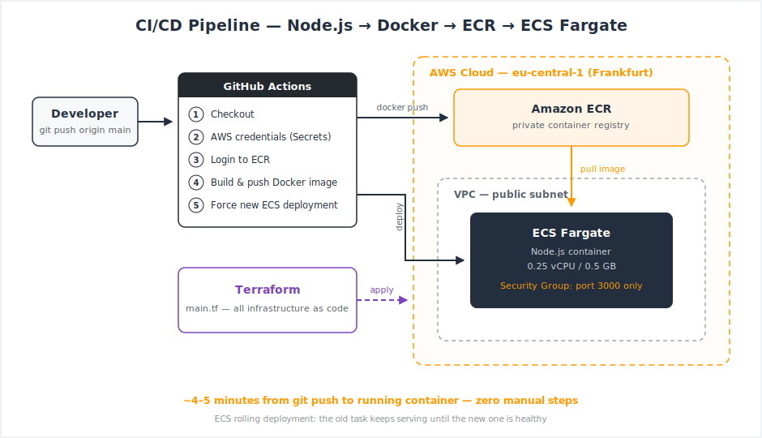

# AWS Project 5 — CI/CD Pipeline: Node.js → Docker → ECR → ECS Fargate

A fully automated deployment pipeline: every push to `main` builds a Docker image, pushes it to Amazon ECR, and triggers a new deployment on ECS Fargate — all infrastructure defined in Terraform.

**Stack:** Node.js · Docker · Amazon ECR · ECS Fargate · Terraform · GitHub Actions

---

## Architecture



**Flow:**
1. Developer pushes code to `main`
2. GitHub Actions workflow starts automatically
3. Docker image is built and tagged
4. Image is pushed to a private Amazon ECR repository
5. Pipeline triggers a new deployment on ECS Fargate (`--force-new-deployment`)
6. Fargate pulls the new image and performs a rolling deployment — the old task keeps serving traffic until the new one is healthy

**Time from `git push` to running container: ~4–5 minutes. Zero manual steps.**

---

## What I Built

| Component | Details |
|---|---|
| **Application** | Minimal Node.js web server (Express) listening on port 3000 |
| **Container** | Dockerfile based on `node:alpine` — small image, fast builds |
| **Registry** | Private ECR repository, images tagged per build |
| **Compute** | ECS Fargate task: 0.25 vCPU / 0.5 GB RAM — no servers to manage |
| **Network** | Dedicated VPC with public subnets, Security Group allowing inbound only on port 3000 |
| **IAM** | Separate Task Execution Role (pull image, write logs) and Task Role (app permissions — intentionally empty) |
| **IaC** | Entire infrastructure defined in Terraform (`terraform/main.tf`) |
| **CI/CD** | GitHub Actions workflow (`.github/workflows/deploy.yml`), AWS credentials stored as encrypted GitHub Secrets |

---

## Key Design Decisions

**Terraform for everything.** No resource was created by clicking in the AWS Console. `terraform plan` shows every change before it happens, `terraform apply` builds it, `terraform destroy` removes it completely. The infrastructure is versioned in Git — reproducible, reviewable, and nothing lives only in my head.

**Two IAM roles, not one.** The *Task Execution Role* is what Fargate itself needs (pull from ECR, write to CloudWatch Logs). The *Task Role* is what the application is allowed to do — and since this app needs nothing, it gets nothing. Least privilege by default.

**No credentials in code.** AWS access keys live as encrypted GitHub Secrets and appear only as `***` in workflow logs.

**Public subnet with public IP — a deliberate cost decision.** The Fargate task needs internet access to pull images from ECR. The production-grade solution is private subnets + NAT Gateway (or VPC endpoints), but a NAT Gateway costs ~$35/month — disproportionate for a learning project. The Security Group still only allows port 3000 inbound. In a production system (especially one handling sensitive data), tasks would run in private subnets behind an Application Load Balancer.

---

## Errors I Actually Hit (and Fixed)

Real projects have real errors. These cost me hours — and taught me more than the happy path ever could:

| # | Error | Root Cause | Fix |
|---|---|---|---|
| 1 | `Unable to assume the service linked role` on first ECS deploy | The ECS service-linked role doesn't exist in a fresh account until first use | Created it explicitly: `aws iam create-service-linked-role --aws-service-name ecs.amazonaws.com` |
| 2 | Resource conflict on `terraform apply` | A leftover CloudFormation stack from an earlier console experiment owned the same resources | Deleted the old stack, re-ran `apply` — and learned to never mix console experiments with IaC |
| 3 | `refusing to allow a Personal Access Token to create or update workflow` | GitHub PAT was missing the `workflow` scope | Regenerated the token with the correct scope |
| 4 | Pipeline failed silently on a step | YAML indentation error in the workflow file | Fixed indentation; now I lint workflow files before pushing |
| 5 | Pipeline couldn't find the ECR repository | Naming mismatch: some resources named `projekt` (German), others `project` (English) — one letter apart | Renamed everything to one strict convention: English, lowercase, hyphen-separated |

Lesson #5 is my favorite: one character cost me an hour of debugging. Since then, naming conventions are non-negotiable.

---

## Cost Awareness

- Fargate (0.25 vCPU / 0.5 GB, 24/7): ~**$10/month**
- ECR storage + GitHub Actions (public repo): negligible
- The ECS service is scaled to **0 tasks when not in use** — infrastructure stays defined in Terraform and comes back with one `apply`. Shutting down what you don't need is part of cloud architecture.

---

## What I'd Improve Next

- **Test stage in the pipeline** — run `npm test` before the build step; a red test blocks the deployment
- **OIDC instead of static AWS keys** — GitHub Actions assumes an IAM role directly, no stored credentials at all
- **Application Load Balancer** + tasks in private subnets — the production network layout
- **Terraform remote state** in S3 with locking — required as soon as more than one person works on the infrastructure
- **Blue/green deployments** with the ECS deployment circuit breaker for automatic rollback

---

## Repository Structure

```
.
├── app.js                        # Node.js application
├── Dockerfile                    # Container definition (node:alpine)
├── .github/
│   └── workflows/
│       └── deploy.yml            # CI/CD pipeline
├── terraform/
│   └── main.tf                   # Complete infrastructure as code
├── architecture-diagram.svg
└── README.md
```

---

*Part of my AWS portfolio — six hands-on projects covering S3/CloudFront, high availability, RDS/DynamoDB, serverless, CI/CD, and database migration.*
